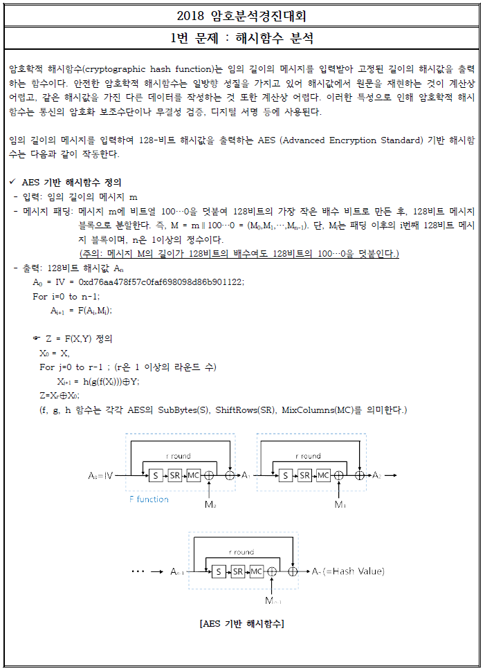
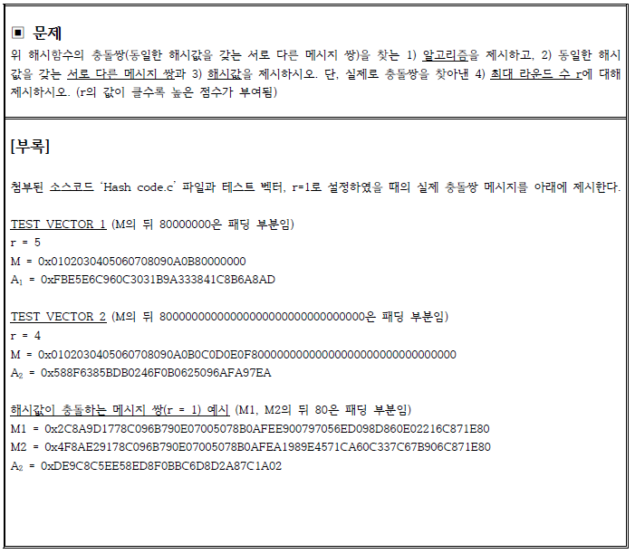
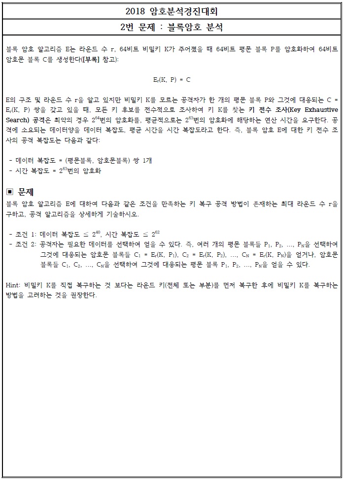
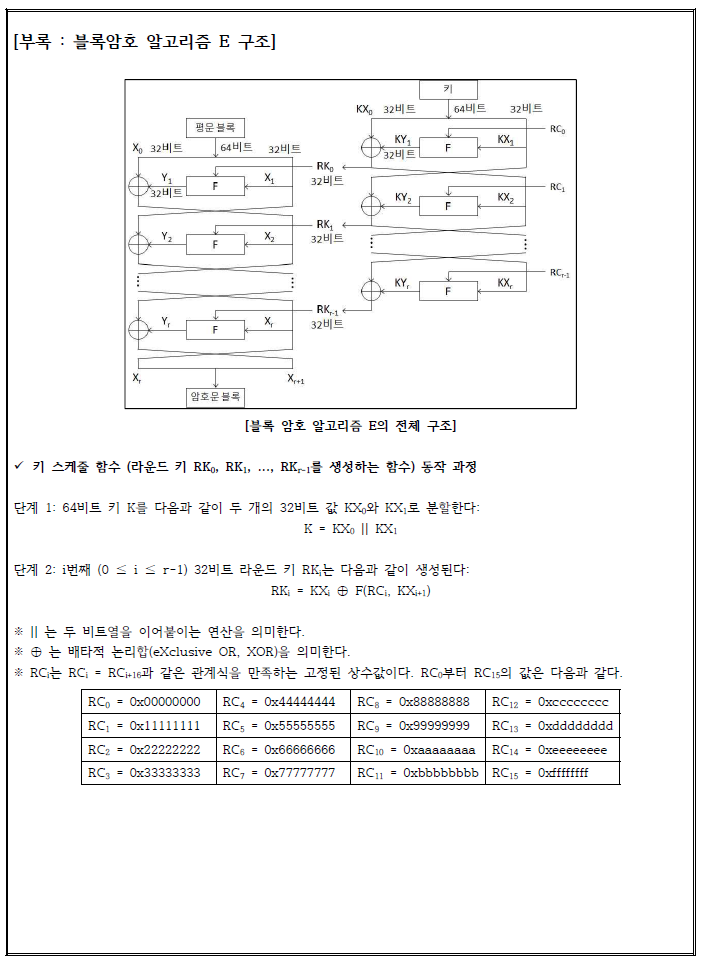
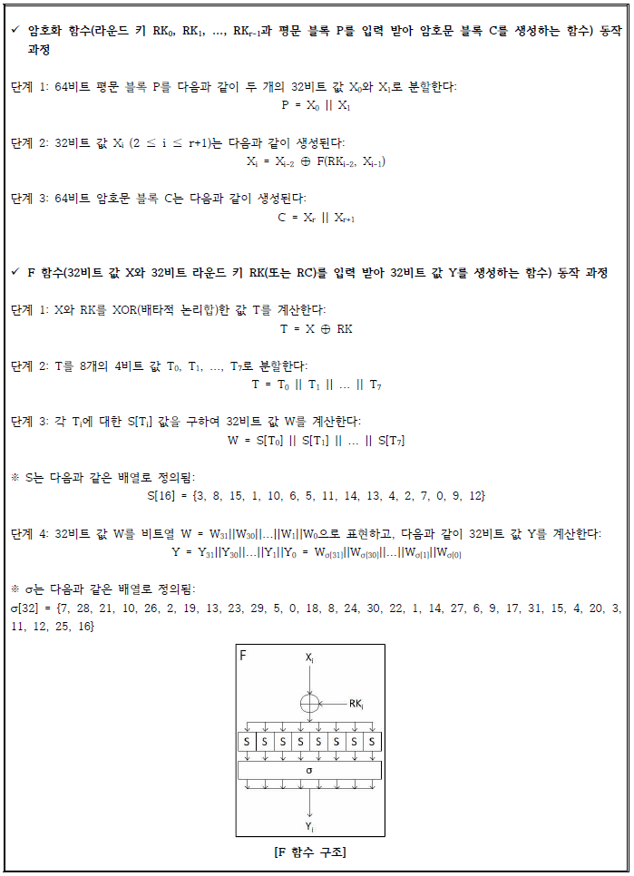
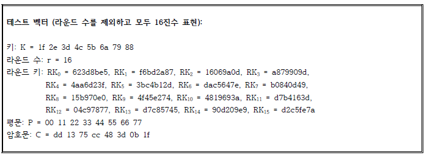

# cryptanalysis-contest-2018

## 결과

## 후기

## 문제와 풀이

### 1번 문제

AES 알고리즘은 현재까지도 사용되고 있는 안전한 대칭키 암호 알고리즘이다. 그런 알고리즘을 변형해 사용한다고 해서 안전성이 보장되지 않는다는 것을 배울 수 있는 문제이다.

우리 팀은 Xor의 성질과 알고리즘의 특징을 이용해서 성공 확률이 50%인 확률론적 알고리즘을 만들어냈고, 50%확률이므로 알고리즘을 수차례 적용하면 반드시 충돌쌍을 찾을 수 있다.

결과 : 최대라운드에 대한 충돌쌍을 찾는 데에 시간복잡도 O(1)로 해결이 가능하다. (여기서 말하는 시간복잡도 O(1)은 bit 연산이 아닌, 해시함수의 수행횟수를 의미한다.)

자세한 풀이는 아래 링크 참조.

[1번문제 답안](./answer-sheet/2018암호분석경진대회_1번_답안지_박영재_서울시립대학교.pdf)

### 2번

Feistel 구조를 가지는 블록암호가 주어져있다. 이 블록암호의 Key를 시간복잡도 2^62, 공간복잡도 2^40 이내로 복구하는 문제이다. 블록암호의 Round 수가 증가할수록 안전한 암호가 되므로, 최대한 높은 라운드의 블록암호의 키를 복구하면 된다.

이 문제를 풀기 위해서는 문제에서 주어진 알고리즘을 구현해야 한다. 알고리즘의 성능이 매우 중요하기 때문에 C언어를 사용해 구현했고, 비트 연산을 적극 활용했다.

블록암호의 공격 방법으로는 DC(Differential Cryptanalysis), LC(Linear Cryptanalysis) 둘 중 하나를 선택하는 것이 일반적이다. 이 두 개념은 학부에서는 배우지 않으며, 개념 또한 매우 어렵다. 공격 방법이 통계와 확률에 기반했기 때문에, 수학을 전공했다면 일주일 이상 시간 투자를 하면 감을 잡을 수 있다. 

[DC 참고 논문](./paper/Differential_Cryptanalysis_of_DES_like_Cryptosystems.pdf)

[LC 참고 논문](./paper/Linear_Cryptanalysis_of_DES_Cipher.pdf)

우리 팀은 DC를 이용해 문제에 접근했다. DC를 적용하기 위해서는 반드시 입력 차분 쌍들을 수집해야 한다. 랜덤한 입력 차분을 사용할 경우 라운드함수가 작더라도, 시간복잡도는 급격하게 높아진다. 따라서 시간복잡도에 대해 생각해 봐야 한다.

시간복잡도를 낮추기 위해서는 S-box의 Input 차분이 0이 되도록 만드는 것이 좋다. 입력차분이 0이라면 출력차분이 0이 될 확률이 100%이므로 확률을 최대한 높일 수 있다. 정의에 따르면, 입력차분이 0이 아닌 경우를 active S-box라고 부르며, active S-box의 개수가 적을 수록 확률이 높아진다.

하지만, 문제에서 제시한 알고리즘은 '암호학적 쇄도 효과'가 높은 알고리즘이다. 따라서 1Round를 통과하면 active S box의 개수가 1개로 시작하더라도 2Round에서 4개로 증가한다. 따라서 무언가 조치가 필요하다.

우리 팀은 '암호학적 쇄도 효과'가 적게 일어나는 차분을 고민했고, Iterative한 차분이 active S-box를 항상 일정하게 유지할 수 있다는 것을 파악했고, Iterative한 차분을 찾는 프로그램을 파이썬으로 구현했다. 

차분을 찾는 과정과 차분을 이용해서 DC를 적용하는 방법은 답안을 참조하자.

[2번문제 답안](./answer-sheet/2018암호분석경진대회_2번_답안지_박영재_서울시립대학교.pdf)

### 3번

[3번문제 답안](./answer-sheet/2018암호분석경진대회_3번_답안지_박영재_서울시립대학교.pdf)

### 4번

[4번문제 답안](./answer-sheet/2018암호분석경진대회_4번_답안지_박영재_서울시립대학교.pdf)

### 5번

[5번문제 답안](./answer-sheet/2018암호분석경진대회_5번_답안지_박영재_서울시립대학교.pdf)

### 6번

[6번문제 답안](./answer-sheet/2018암호분석경진대회_6번_답안지_박영재_서울시립대학교.pdf)