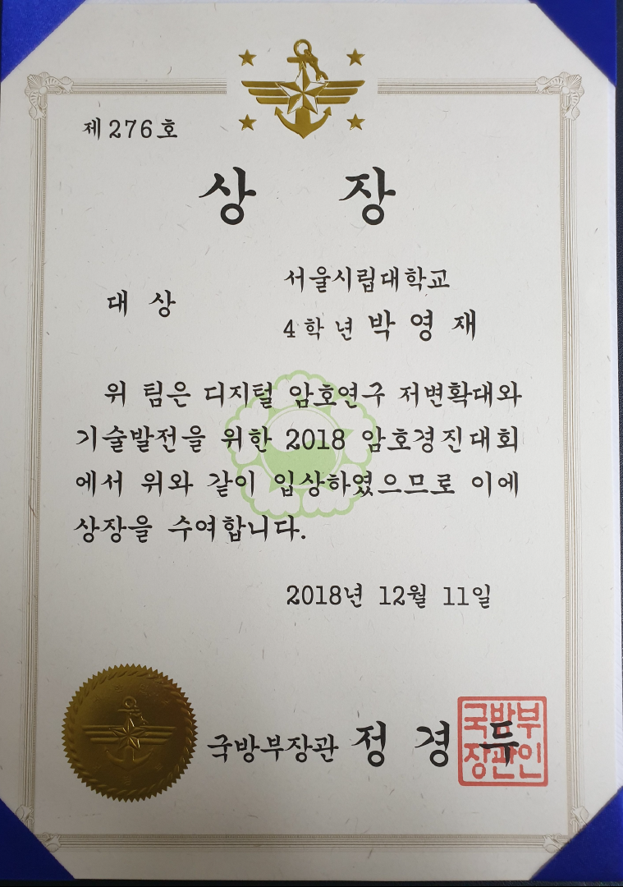
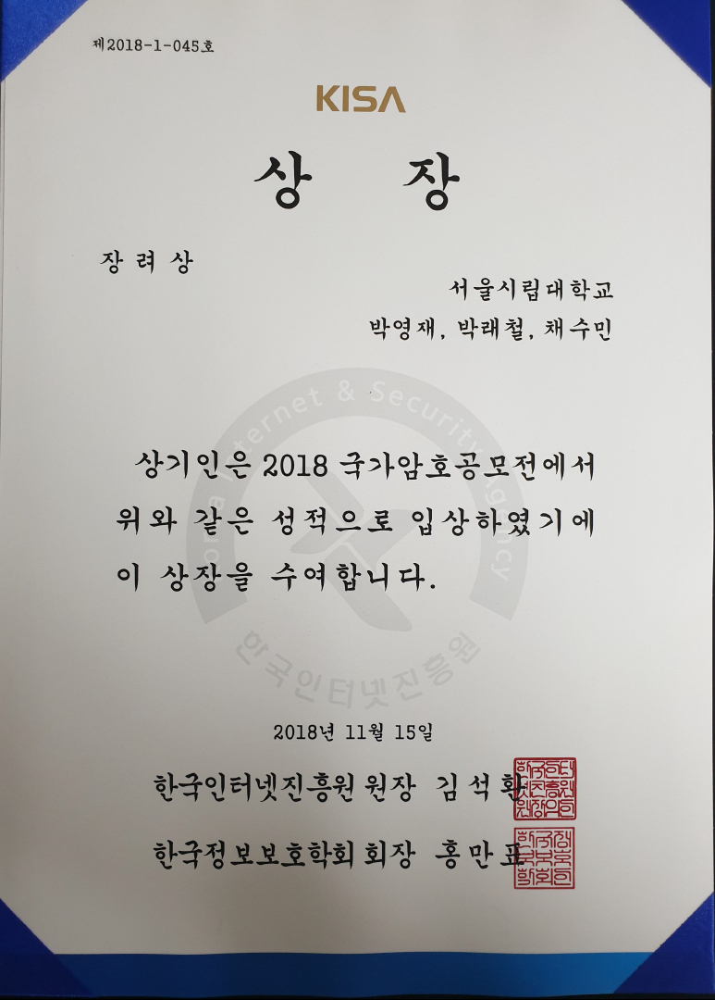

# cryptanalysis-contest-2018

## 결과

**암호분석경진대회는 국방부장관상을 수상했으며, 암호공모전은 장려상을 수상했습니다.**

암호분석경진대회의 2번과 4번은 창의적인 풀이로 인정받아, 시상식에서 PT발표를 하게 됐습니다. **777사령부, 국방부장관, 교수님들 앞에서 발표하는 멋진 기회였습니다.**

## 후기

### 암호학에 대한 깊은 이해

두 공모전은 암호 알고리즘을 구현해보는 기회도 얻을 수 있으며, 알고리즘을 직접 공격해보며 '암호'가 왜 안전한 지에 대한 탐구를 할 수 있습니다. 

### 문제 해결 능력

다양한 공격 알고리즘을 `논문`이나 `서적`을 통해 찾아본 후, 해당 알고리즘의 성공확률을 계산하고, 우리의 알고리즘에 맞게 구현해야 합니다. 이러한 경험은 자신이 마주하고 있는 문제에 대한 해결책을 찾는 방법, 그 해결책을 마주하고 있는 문제에 맞게 변형하는 방법 과 같은 역량을 길러준다고 생각합니다.

### 알고리즘 구현, 시간복잡도, 성능 측정, 성능 개선

소프트웨어 개발 능력도 향상할 수 있습니다. 암호 알고리즘 구현을 포함해 다양한 알고리즘을 구현해볼 수 있습니다. 뿐만 아니라, 프로그램의 시간복잡도가 매우 높기 때문에 디버깅이 쉽지 않습니다. 따라서 완벽하게 알고리즘을 설계해야 하고, 시간복잡도와 성능측정을 매우 꼼꼼하게 확인해야 합니다. 성능을 측정하고 동작 시간을 예측하는 이유는, 프로그램이 예측한 시간보다 오래 동작할 경우 프로그램에 문제가 생겼다고 판단할 수 있기 때문입니다. 성능을 향상 시키기 위한 행동, 알고리즘에 오류가 있는지 파악하는 행동, 디버깅, 성능측정 모두 서버 개발자가 갖춰야 할 역량이라고 생각합니다.

따라서 암호학을 전공하시는 분들 외에도, 소프트웨어 개발자도 두 공모전에 참여해서 얻어갈 것이 많다고 생각합니다. (상금도 500만원으로 아주 크고요..!)

## 문제와 풀이

### 1번 문제

AES 알고리즘은 현재까지도 사용되고 있는 안전한 대칭키 암호 알고리즘입니다. 그런 알고리즘을 변형해 사용한다고 해도 안전성이 보장되지 않는다는 것을 배울 수 있는 문제입니다.

저희 팀은 Xor의 성질과 알고리즘의 특징을 이용해서 성공 확률이 50%인 확률론적 알고리즘을 만들어냈고, 50%확률이므로 알고리즘을 수차례 적용하면 반드시 충돌쌍을 찾을 수 있습니다. 알고리즘을 한 번 수행하는 데에 해시함수 연산 2번이 일어나므로, 시간복잡도는 O(1)이라고 할 수 있습니다. 여기서 말하는 시간복잡도 O(1)은 bit 연산이 아닌, 해시함수의 수행횟수를 의미합니다. 라운드에 따라서 해시함수의 시간복잡도가 달라지기 때문에 해시함수를 기준으로 시간복잡도를 계산하는 것이 바람직합니다.

결과 : **최대라운드에 대한 충돌쌍을 찾는 데에 시간복잡도 O(1)로 해결이 했으며, 가장 높은 점수를 획득했습니다.** 

자세한 풀이는 답안지를 참고하시길 바랍니다.

[1번문제 답안](./answer-sheet/2018암호분석경진대회_1번_답안지_박영재_서울시립대학교.pdf)

### 2번

Feistel 구조를 가지는 블록암호가 주어져있습니다. 이 블록암호의 Key를 시간복잡도 2^62, 공간복잡도 2^40 이내로 복구하는 문제입니다. 블록암호의 Round 수가 증가할수록 안전한 암호가 되므로, 최대한 높은 라운드의 블록암호의 키를 복구하면 됩니다.

이 문제를 풀기 위해서는 문제에서 주어진 알고리즘을 구현해야 합니다. 알고리즘의 성능이 매우 중요하기 때문에 C언어를 사용해 구현했고, 비트 연산을 적극 활용했습니다.

블록암호의 공격 방법으로는 DC(Differential Cryptanalysis), LC(Linear Cryptanalysis) 둘 중 하나를 선택하는 것이 일반적입니다. 

[DC 참고 논문](./paper/Differential_Cryptanalysis_of_DES_like_Cryptosystems.pdf)

[LC 참고 논문](./paper/Linear_Cryptanalysis_of_DES_Cipher.pdf)

우리 팀은 DC를 이용해 문제에 접근했습니다. DC를 적용하기 위해서는 반드시 입력 차분 쌍들을 수집해야 합니다. 랜덤한 입력 차분을 사용할 경우 라운드함수가 작더라도, 시간복잡도는 급격하게 높아집니다. 따라서 시간복잡도에 대해 생각해 봐야 합니다.

시간복잡도를 낮추기 위해서는 S-box의 Input 차분이 0이 되도록 만드는 것이 좋습니다. 입력차분이 0이라면 출력차분이 0이 될 확률이 100%이기 때문에 확률을 최대한 높일 수 있습니다. 정의에 따르면, 입력차분이 0이 아닌 경우를 active S-box라고 부르며, active S-box의 개수가 적을 수록 확률이 높아집니다.

하지만, 문제에서 제시한 알고리즘은 '암호학적 쇄도 효과'가 높은 알고리즘입니다. 따라서 1Round를 통과하면 active S box의 개수가 1개로 시작하더라도 2Round에서 4개로 증가합니다. 따라서 무언가 조치가 필요하게 됩니다.

저희 팀은 '암호학적 쇄도 효과'가 적게 일어나는 차분을 고민했고, Iterative한 차분이 active S-box를 항상 일정하게 유지할 수 있다는 것을 파악했습니다. Iterative한 차분을 찾는 프로그램은 파이썬으로 구현했습니다. 

결과 : Iterative 차분을 활용한 DC공격 결과, **공간 복잡도 2^39, 시간 복잡도 2^44로 12Round Master key를 복구**하여 가장 높은 점수를 획득했습니다.

차분을 찾는 과정과 차분을 이용해서 DC를 적용하는 자세한 방법은 답안을 참조하길 바랍니다.

[2번문제 답안](./answer-sheet/2018암호분석경진대회_2번_답안지_박영재_서울시립대학교.pdf)

### 3번

LSFR을 이용한 키스트림 생성기가 주어져있습니다. 초기 키스트림을 알고있을 때, 나머지 PW를 찾는 문제입니다. 

이 문제는 행렬의 또 다른 쓰임새를 알 수 있는 좋은 문제입니다. 주어진 상황을 행렬로 표현하고, 행렬의 역행렬을 이용해 키를 찾을 수 있습니다. 조심해야 할 점은, 역행렬이 존재하지 않을 수 있다는 점입니다. 따라서 역행렬을 직접 구하기보다는 `가우스 소거법`을 이용해 행렬을 `Upper Triangle`로 만들고 전수조사하는 것이 좋습니다. 

결과 : 행렬의 크기는 32*32 이므로 행렬의 연산 시간복잡도 32^3과 LFSR의 전수조사 시간복잡도 2^28을 곱하여, 최종 시간복잡도는 2^43이 됩니다. 작은 크기에 대해서 시간을 측정하였고, 10대의 컴퓨터에 일을 분산하여 3시간 내외로 정답을 얻었습니다.

자세한 풀이 과정은 답안지를 참고하길 바랍니다.

[3번문제 답안](./answer-sheet/2018암호분석경진대회_3번_답안지_박영재_서울시립대학교.pdf)

### 4번

4번 문항은 부채널 분석과 관련된 문제입니다. `ECC`라는 대표적인 공개키암호를 이용해서 `dP = P+P+P+...+P` 라는 연산을 수행할 때 발생하는 전력을 수집했다고 합니다. 이 전력 파형들로 개인키 d를 찾는 알고리즘을 구현하고, 그 때의 개인키 d를 찾는 것이 문제입니다.

이 문제는 덧셈 연산과 뺄셈 연산으로 발생하는 전력 차이는 구분할 수 없고, 연산을 수행할 때, state라는 상태 변수를 둬서 뺄셈을 적극 활용하고 있습니다. 따라서 전력 파형 1개만을 가지고 키를 찾는 것은 불가능합니다.

결론 : 저희 팀은 전력 파형들을 가지고 역으로 나올 수 있는 모든 개인키를 찾았습니다. 그리고 그 개인키들의 일부 교집합을 통해 등장하는 키를 후보키로 지정했습니다. 50개의 키수열 리스트에서 모든 후보키를 찾았고, 20대의 컴퓨터를 사용하여 약 2일정도의 시간을 소요했습니다.

자세한 풀이 과정은 답안지를 참고하길 바란다.

[4번문제 답안](./answer-sheet/2018암호분석경진대회_4번_답안지_박영재_서울시립대학교.pdf)

### 5번

ARX 연산으로 구성된 경량암호 알고리즘이 주어져있습니다. 이 알고리즘은 `8bit processor`를 사용하는 플랫폼에서 동작될 것이라고 합니다. 우리는 주어진 알고리즘을 최적화하여 연산의 속도를 높여야 합니다. 

접근 방법

1.`key_gen`을 Table Look up 방식으로 변경하여 속도를 향상시킨다.

이 방법은 key1과 key2의 사이즈를 고려했을 때, 1310720byte가 필요하므로 아두이노의 저장용량을 초과합니다. 따라서 사용할 수 없습니다.

2. `ROL` 함수를 Table Look up 방식으로 변경하여 속도를 향상시킨다.

key_gen 함수의 key1 = ROL(key1,4) 와 key2 = ROL(key2,6) 대신에 그에 해당되는 table을 미리 구하여 key1table과 key2table에 저장하고, 마찬가지로 enc 함수의 `ROL(text1,1) + ROL(text1,2) + ROL(text1,3) + ROL(text1,4) 와 ROL(text2,4) + ROL(text2,5) + ROL(text2,6) + ROL(text2,7)`를 대신하여 text1table과 text2table에 저장하면 연산 과정을 최소화할 수 있습니다.

3. `for`문을 제거한다.

for문은 구현상의 편의를 제공해주지만, i라는 `iterator`에 들어가는 코스트가 생기게 됩니다. 일반적인 Server 개발에서는 고려할 부분이 아니지만, **아두이노에서 사용하는 경량 암호는 코드의 유지보수성을 고려할 것이 아니라, 성능을 고려해야 합니다.**

결론 : 2번과 3번을 적용하여 기존에 주어진 알고리즘보다 **약 45%의 성능을 향상시킬 수 있었고, 참가 팀 중에서 가장 빠른 속도로 인정받았습니다.**

자세한 풀이 과정은 답안지를 참고하길 바랍니다.

[제출 소스 코드](https://github.com/pjok1122/cryptanalysis-contest-2018/blob/master/method2/method2/method2.ino)

[5번문제 답안](./answer-sheet/2018암호분석경진대회_5번_답안지_박영재_서울시립대학교.pdf)

### 6번

TLS 통신과 암호화 과정을 잘 이해할 수 있는 좋은 문제입니다.

이 문제는 TLS 통신 전체적인 플로우를 따라가야 합니다. 일반적으로 가공된 자료들에는 `Session hash`, `Premaster Secret` 같은 정의가 나와있지 않습니다. 따라서 저희 팀은 `TLS 통신 1.2 - IETF` 문서를 참고했습니다. 

자세한 풀이 과정은 답안지를 참고하길 바랍니다.

[6번문제 답안](./answer-sheet/2018암호분석경진대회_6번_답안지_박영재_서울시립대학교.pdf)